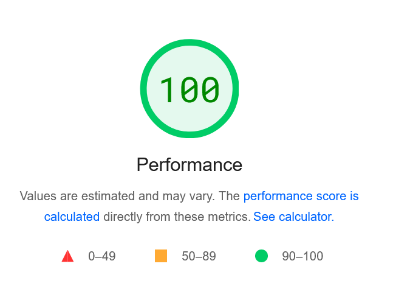
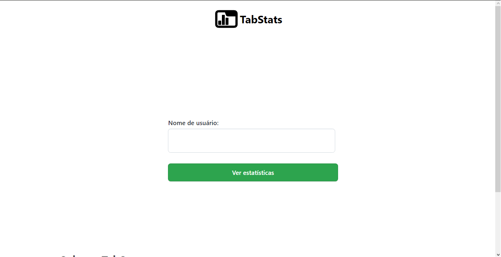
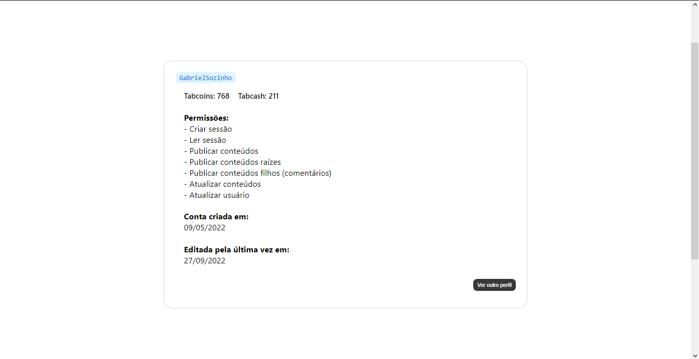

<h1 align="center">
TabStats
</h1>

Um site open-source usado para visualizar informações de usuários do TabNews.

<h4 align="center"><a href="https://tabstats.ga">Clique para visitar o site</a></h4>

Feito com ❤ por <a href="https://github.com/gabrielsozinho">Gabriel Sozinho</a> e <a href="https://github.com/gabrielsozinho/TabStats/graphs/contributors">contribuidores</a>

 

## Features
- Ver quantidade de Tabcoins e Tabcashs.
- Ver todas as permissões que o usuário possui.
- Ver quando a conta foi criada.
- Ver quando a conta foi editada pela última vez.

## Roadmap
- Quantidade de publicações.
- Quantidade de comentários.
- Gráfico com informações de atividade.
- Ranking de TabCoin e TabCash

## Tecnologias usadas:
- HTML5
- CSS3
- JavaScript

## Screenshots

## Contribuições:
Pull requests são aceitas. Para grandes mudanças, por favor, abra primeiro uma issue para discutir o que você gostaria de mudar.

O commit semântico possui os elementos estruturais abaixo (tipos), que informam a intenção do seu commit ao utilizador(a) de seu código.

## Guia de contribuição
- `feat`- Commits do tipo feat indicam que seu trecho de código está incluindo um **novo recurso** (se relaciona com o MINOR do versionamento semântico).

- `fix` - Commits do tipo fix indicam que seu trecho de código commitado está **solucionando um problema** (bug fix), (se relaciona com o PATCH do versionamento semântico).

- `docs` - Commits do tipo docs indicam que houveram **mudanças na documentação**, como por exemplo no Readme do seu repositório. (Não inclui alterações em código).

- `test` - Commits do tipo test são utilizados quando são realizadas **alterações em testes**, seja criando, alterando ou excluindo testes unitários. (Não inclui alterações em código)

- `build` - Commits do tipo build são utilizados quando são realizadas modificações em **arquivos de build e dependências**.

- `perf` - Commits do tipo perf servem para identificar quaisquer alterações de código que estejam relacionadas a **performance**.

- `style` - Commits do tipo style indicam que houveram alterações referentes a **formatações de código**, semicolons, trailing spaces, lint... (Não inclui alterações em código).

- `refactor` - Commits do tipo refactor referem-se a mudanças devido a **refatorações que não alterem sua funcionalidade**, como por exemplo, uma alteração no formato como é processada determinada parte da tela, mas que manteve a mesma funcionalidade, ou melhorias de performance devido a um code review.

- `chore` - Commits do tipo chore indicam **atualizações de tarefas** de build, configurações de administrador, pacotes... como por exemplo adicionar um pacote no gitignore. (Não inclui alterações em código)

- `ci` - Commits do tipo ci indicam mudanças relacionadas a **integração contínua** (*continuous integration*).

## Licensa
[MIT](https://choosealicense.com/licenses/mit/)
